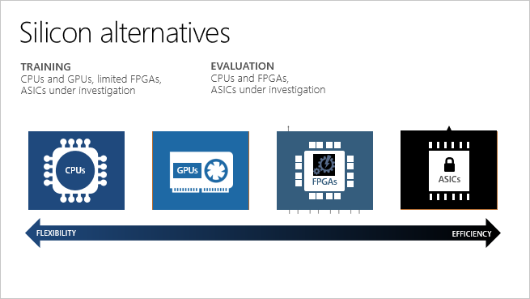
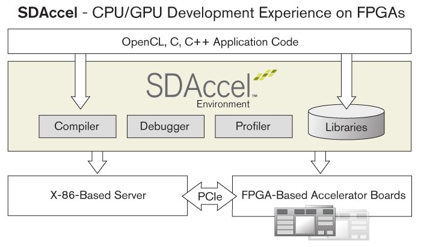

# FPGA-accelerated AI

## Background

Artifical intelligence and its subset deep learning, are important techniques in many applications. However, in product-level online inference process, the expectant latency is strictly limited, preventing the use of large and complex models. Precision may be sacrificed for low latency. How to reduce training and inference time of neural networks has been an important research area. In addition to model optimization, hardware approaches are also commonly considered.

### AI accelerator

As Moore's Law approaches to its ending, we are at the end of the performance scaling that we are used to. To accelerate computing, we cannot depend on CPU processors to get faster in high speed as they used to be, but have to design alternative approaches, for example, using specialized processors. In the industry, Google has its TPU (Tensor Processing Unit), with one core per chip and software-cotrolled memory instead of caches; NVidia's GPU has 80-plus cores; and Microsoft is taking an FPGA approach.

## FPGA introduction

A FPGA (field-programmable gate array) is an integrated circuit designed to be configured after manufacturing. 

FPGA can be simplistically thought of as boards containing low-level chip fundamentals, such as AND and OR gates. The FPGA configuration is generally specified using a hardware description language (HDL). Using this HDL the fundamentals can be configured in a way that matches the requirements of specific tasks or applications, in essence mimicking application-specific integrated circuits (ASICs).

A FPGA can be used to solve any problem which is computable. Their advantage lies in that they are sometimes significantly faster for some applications because of their parallel nature and optimality in terms of the number of gates used for a certain process. 

FPGAs are commonly used in hardware acceleration, where one can use FPGA to accelerate certain parts of an algorithm and share part of the computation between the FPGA and a generic processor.

### Advantages

1. FPGAs provide a combination of programmability and performance comparing to ASIC and CPU/GPU. 

    ASIC is known for its performance, but it can cost huge amount of time to design the specific circuit to achieve best performance. Meanwhile, deap learning frameworks are still evolving, making it hard to design or update custom hardware. FPGAs are reconfigurable, and far easier to design and program comparing to ASIC, making them convenient to extend to a range of applications, e.g. several different types of nueral networks. FPGA structure can be considered as an alternative to software, but is implemented directly on hardware.

    Comparing to GPU/CPU, FPGA is customized and specialized in specific application, making it faster and more energy-efficient, since general-purpose processors invest excessive hardware resources flwxibly support various workloads. Also, due to the intrinsic property of FPGAs, they have high compute throughput and networking throughput, and low compute or network latency.

    

2. Parallelism 

    There are several specific types of parallelism in neural networks:
    * _Training parallelism:_ Different training sessions can be run in parallel.
    * _Layer parallelism:_ In a multilayer network, different layers can be processed in parallel.
    * _Node parallelism:_ Node parallelism matches FPGAs very well, since a typical FPGA basically consists of a large number of "cells" that can operate in parallel, on which neurons can be mapped.
    * _Weight parallelism:_ Common implementations of neural networks rely heavily on dense matrix multiplication, which is natural suitable for parallel computing. In the computation of an output $y=\Phi(\sum_{i=1}^n w_i x_i)$, where $x_i$ is an input and $w_i$ is a weight, the products $x_iw_i$ can all be computed in parallel, and the sum of these products can also be computed with high parallelism (e.g. by using an adder-tree of logarithmic depth).

    Typically, conventional (i.e. sequential) general-purpose processors do not fully exploit the parallelism inherent in neural network model. CPUs or GPUs have only limited cores, limiting parallelism, while FPGAs have a massive amount of parallelism built-in. Modern FPGAs may have millions of logic elements, hundreds registers, tens of block RAMs, and thousands of DSP blocks, and each of them can work in parallel theoretically.
    
    Although some SIMD features are already implemented in CPU providng instruction level parallelism, this parallelism is still weaker than FPGAs, and the specificly designed dataflow and memory pattern in FPGAs surely provide better parallelism.

### FPGAs for neural networks

1. Heterogenous computation

    Comparing to CPU/GPU, there are some drawbacks of FPGAs, too. Specific hardware programming is needed to implement applications on FPGAs. However, the toolchain and DHL of FPGA programming is hard to use and sometimes buggy, requiring extra time for developer to learn their usage. Also, developers are required to have deep understanding of FPGA's architecture and its design to develop high efficient programs.

    There are some projects available to solve this issue. Microsoft's BrainSlice project, provides a software/hardware interface, making the hardware part of program invisible to software developer. BrainSlice implements a tensor processor, including an instruction decoder, and opens several useful C-style APIs, such as vector-add, matrix-vector-multiply, etc. Software engineers specify each operation's instructions, send operation info and data to FPGAs, and process the recieved results from the FPGAs.

2. Networking (data transfering between CPU and FPGA)

    In Microsoft's Project Brainwave, FPGA communicates with CPUs and other FPGAs via [LTL](https://www.microsoft.com/en-us/research/wp-content/uploads/2016/10/Cloud-Scale-Acceleration-Architecture.pdf) (Lightweight Transport Layer).

    LTL is a protocol that supports lightweight connections between pairs of FPGAs, with mostly lossless transport and extremely low latency. This protocol makes the datacenter-scale remote FPGA resources appear closer than either a single local remote SSD access or the time to get through the host's networking stack.

    With this protocol designed and implemented on FPGAs, programs can run on multi-devices with ignorable communication cost, thus get higher performance.

3. Low precision computing

    Quatization is a simple and efficient approach to accelerating inference and a sophisticatedly designed quantization method does not damage prediction accuracy of neural networks. Some frequently-used quantization methods, such as fixed-point quantization and low-precision floating point, can be easily implemented in FPGA, making quantization and de-quantization process, along with low-precision numbers' arithmetics faster than their implementation on CPU, since some specific data formats are not naturally supported by general-purpose CPUs.

    For example, in Microsoft, we have a special quantization format called ms-fp9, which includes 1 bit sign, 5 bits exponent and 3 bits mantissa. It can be very hard to implement ms-fp9 arithmetics on CPUs, but on FPGA, we can store ms-gp9 numbers in 9-bit register, and easily design specific arithmetics units for it.

    Accuracy of three models using different quantization formats:

    

    Peak performance of the Brainwave DPU across three generations of Intel FPGAs:

    

    What's more, cumstomized compression can be designed for and implemented on FPGAs to reduce model size further.

4. Application-specific architecture

    There are several aspects of computer arithmetic that need to be considered in the design of neurocomputers; these include data representation, inner-product computation, implementation of activation functions, storage and update of weights, and the nature of learning algorithms. 

5. Domain-specific ISA

    If the architecture is designed as an instruction system with a decoder, new ISA has to be designed. Although it is not necessary to apply the idea of CPU architecture on FPGA, but the architecture including ISA gives FPGA more flexibility to implement different types of neural networks.

    Although it is not a FPGA system but an ASIC one, [Cambricon's ISA](https://ieeexplore.ieee.org/document/7551409/) is a good example for this. Based on a comprehensive analysis of existing neural networks techniques, the developers designed a domain-specific instruction set for their chips, which integrates scalar, vector, matrix, logical, data transfer and control instructions.

6. What's more?

    FPGA-specific neural network model

    ~~[TODO] BrainChip's spike NN?~~

## Industry Projects

1. Microsoft's Project [BrainWave](https://www.microsoft.com/en-us/research/project/project-brainwave/) ([aml-real-time-ai]((https://github.com/Azure/aml-real-time-ai)))

    Project Brainwave is a deep learning acceleration platform for cloud customers. Deployed on Intel FPGA, Project Brainwave allows customers to access dedicated hardware that can accelerate real-time AI calculations giving a competitive cost benefit with low latency. In addition, Microsoft developed and tested a custom 9-bit floating-point format (FP9) before settling on an 8-bit format (FP8) that doubles performance over standard INT8. To meet the needs of its data centers, Microsoft also optimized Brainwave for low latency, maintaining high efficiency even with small numbers of requests.

    **Brainwave Architecture**

    Brainwave consists of three main layers:

    1. a tool flow and runtimes for low-friction deployment of trained models,
    2. a distributed system architecture mapped onto CPUs and hardware microservices, and
    3. a high-performance soft DNN processing unit synthesized onto FPGAs.

    

    In this architecture, first, DNN models are exported into a common graph intermediate representation (IR). Tool flow optimizes the IR and partitions it into sub-graphs assigned to different CPUs and FPGAs. Device specific backends generate device assembly and are linked together by a federated runtime that gets deployed into a deployable live FPGA hardware microservice.

    On each FPGA, a Brainwave soft NPU is implemented.

    

    The Brainwave NPU is a "mega-SIMD" vector processor architecture. A sequentially programmed control processor asynchronously controls the neighboring neural function unit (NFU) optimized for fast DNN operations. The heart of the NFU is a dense matrix vector multiplication unit (MVU) capable of processing single DNN requests at low batch with high utilization. The MVU is joined to secondary multifunctional units (MFU) that perform element-wise vector-vector operations and activation functions.

    To achive high parallelism in this architecture, the MVU consists of tens of thousands of parallel multiply accumulators organized into parallel multi-lane vector dot product units.

    

    Brainwave has been applied in some of Bing productions. Improvement is significant:

    

    **Azure machine learning - real time AI program.**

    Project Brainwave is now launched on Azure Machine Learning as a hardware accelerated service ([aml-real-time-ai]((https://github.com/Azure/aml-real-time-ai))). Users can easily create and train a model with aml-real-time-AI using various deep neural networks as a featurizer for deployment on Azure for ultra-low latency inferencing. This practice is considered as a first step in making the FPGAs more of a general-purpose platform for customers. While the platform provides extremely low latency for inferencing requests for customers, it also enables the FPGAs to be reconfigured for different types of machine learning models.

2. [BrainChip](https://www.brainchipinc.com/)'s FPGA-based Neuromorphic Accelerator

    BrainChip's accelerator is a PCIe server-accelerator card that simultaneously processes 16 channels of video in a variety of video formats using spiking neural networks rather than convolutional neural networks. The BrainChip Accelerator card is based on a 6-core implementation BrainChip's Spiking Neural Network processor instantiated in an on-board Xilinx Kintex UltraScale FPGA.

    Each BrainChip core performs fast, user-defined image scaling, spike generation, and SNN comparison to recognize objects. The SNNs can be trained using low-resolution images as small as 20x20 pixels.

    The processing is done by six BrainChip Accelerator cores in a Xilinx Kintex Ultrascale field-programmable gate array (FPGA). Each core performs fast, user-defined image scaling, spike generation, and spiking neural network comparison to recognize objects. Scaling images up and down increases the probability of finding objects, and due to the low-power characteristics of spiking neural networks, each core consumes approximately one watt while processing up to 100 frames per second. In comparison to GPU-accelerated deep learning classification neural networks like GoogleNet and AlexNet, this is a 7x improvement of frames/second/watt.

    

    There is only limited information about this chip. Some of its development (such as software API) is still in progress.

3. Baidu's [SDA](https://www.hotchips.org/wp-content/uploads/hc_archives/hc26/HC26-12-day2-epub/HC26.12-5-FPGAs-epub/HC26.12.545-Soft-Def-Acc-Ouyang-baidu-v3--baidu-v4.pdf): Software-Defined Accelerator for Large-Scale DNN Systems

    Baidu has deployed deep nerual networks to accelerate many critical services, such as speech recognition, image search, ads, web page search and natural language processing. DNN usually achieves higher performance in certain jobs, but demands more compute power, and sometimes runs significantly slowlier. Baidu's large-scale DNN system costs large amount of servers and time to train, and online prediction also have seconds of latency for large models. To deal with these problems with low budget, Baidu proposes a software-defined accelerator (SDA) using FPGA as low-level hardware.

    SDA is designed to:
    - Supports major workloads, including training and prediction with floating point numbers.
    - Achieve acceptable performance to about 400 Gflops, higher than 16-core x86 server.
    - Cut budget. Medium-end FPGA is at low cost.
    - Remain the existent data center environments.
    - Support fast iteration.

    The major functions that SDA implements are floating point matrix multiplication and floating point activation functions. The customized FP MUL and ADD units reduce about 50% resource compared to standard IPs. The software-defined activation function unit supports tens of activation functions, including sigmoid, tanh, softsign, etc. It is implemented using lookup table and linear fitting, the lookup table in which can be reconfigured by user-space API.

    SDA APIs includes computation APIs, which are similar to and compatiable with CUBLAS APIs, and reconfiguration API for activation functions.

    **Performance**

    The matrix multiplication's GFlops of CPU, GPU and FPGA are shown below:

    

    And the power consumptions are:

    **Processor** | CPU | FPGA | GPU
    -- | -- | -- | --
    **Gflops/W** | 4 | 12.6 | 8.5

    With online prediction workload, input batch size is small (typically 8 or 16), and the size of hidden layer is from several hundreds to several thousands. Two production workload scenes are set:
    1. Workload 1: batch size = 8, layer = 8, hidden layer size = 512.
    2. Workload 2: batch size = 8, layer = 8, hidden layer size = 2048.

    Under these two circumstances, the requests processed per second are measured:

    

    We can conclude from that FPGA can merge small requests to improve performance and achieve higher throughput, providing higher performance in the DNN prediction system than GPU and CPU server.

    
[TODO] XPU: 

    
    https://www.hotchips.org/wp-content/uploads/hc_archives/hc29/HC29.21-Monday-Pub/HC29.21.40-Processors-Pub/HC29.21.410-XPU-FPGA-Ouyang-Baidu.pdf

    https://www.nextplatform.com/2017/08/22/first-look-baidus-custom-ai-analytics-processor/

4. Xilinx's [XDNN](https://www.nextplatform.com/2018/08/27/xilinx-unveils-xdnn-fpga-architecture-for-ai-inference/) FPGA Architecture for AI Inference

    Xilinx's xDNN architecture focus on inference part of deep learning.

    The xDNN configurable overlay processor maps a range of neural network frameworks onto the VU9P Virtex UltraScale+ FPGA with options to beef up memory, work with custom applications, and tap into a compiler and runtime primed for this on either Amazon's cloud with the F1 instance or in-house.

    FPGAs are data parallel and they support data reuse as well as compression and sparsity by nature. With the xDNN processor's 2D array of MACs, flexible on-chip memory access with high bandwidth, data movement is more efficient. xDNN also supports flexible data types (i.e. FP32/FP16 and INT 16/8/4/2, etc.).

    xDNN is a configurable overlay processor, which means it gets mapped onto the FPGA without need to reprogram after. Xilinx has also provided a DNN specific instruction set (convolutions, max pool, etc.) and can work with any network or image size and can also compile and run new networks. In other words, it can work with TensorFlow without requiring reprogramming or changing the FPGA.

    The Virtex hardware can be tricked out with several types of memory; from the basic distributed RAM that sits next to the DSP blocks to UltraRAM, High Bandwidth Memory, and external DDR4. This allows for optimization for efficiency or performance.

    

    The processing elements are mapped onto the DSP blocks along with the weights, which are held in fast but low-capacity distributed RAM next to the processing. In other words, these distributed RAMs are weight caches.

    xDNN's "Tensor Memory" sits next to the systolic array and hold input and output feature maps. This is also channel parallel so each of those rows in that array are associated with a row of memory. This means xDNN can multitask, computing on the array while also bringing in a new network layer if needed, for instance.

    xDNN also includes instruction-level parallelism, and automatic intra-layer tiling for when feature map sizes exceed on-chip memory, enabling xDNN to work on any feature map size.

    Official Github repository: [ml-suite](https://github.com/Xilinx/ml-suite)

    
[TODO] Further investigation needed.

    https://www.nextplatform.com/2018/07/18/fpga-maker-snaps-up-deep-learning-chip-startup/

    **Xilinx Gemx**

    Also, there is another project in Xilinx called GEMX, which supports dense and sparse fixed point GEMM for MLP.

    Official Github repository: [gemx](https://github.com/Xilinx/gemx)

    **SDAccel**

    Not aiming only for deep learning, Xilinx also provides [SDAccel](https://www.xilinx.com/products/design-tools/software-zone/sdaccel.html) environment which lets developers to build FPGA applications in C/C++.

    

    Official Github repository: [SDAccel-Tutorials](https://github.com/Xilinx/SDAccel-Tutorials), [SDAccel_Examples](https://github.com/Xilinx/SDAccel_Examples)

5. Alibaba [DLP](https://www.alibabacloud.com/blog/ultra-low-latency-and-high-performance-deep-learning-processor-with-fpga_593942)

    Alibaba has developed a FPGA-based ultra-low latency and high performance deep learning processor (DLP). Alibaba said its DLP can support sparse convolution and low precision data computing at the same time, while a customized ISA was defined to meet the requirements for flexibility and user experience. Latency test results with ResNet-18 showed that Alibaba's DLP has a delay of only 0.174 ms.

    The supported computing of DLP includes convolution, batch normalization, activation and other calculations. The architecture is illustrated below:

    

    The Protocal Engine (PE) in the DLP supports Int4 data type input, Int32 data type output, Int16 quantization. Quantization in PE offers over 90% higher efficiency.

    Low precision computing is used in DLP. In the training process, the model is first trained with full accuracy in FP32, then prunning is included, cutting weight to 85%. Re-training is needed on the sparse model to develop an accurate model. Next, weights are quantized with first ADMM (Alternating Direction Method Multipliers) method and then statistical-based feature map quantization. Sparse rate can be as high as 85% using this process with 4% accuracy loss.

    As FPGA development can take weeks or months, Alibaba designed an industry standard architecture (ISA) and compiler to reduce model upgrade time to just a few minutes. Alibaba's software-hardware co-development platform is shown below:

    

    The DLP was implemented on an Alibaba-designed FPGA card, which has PCIe and DDR4 memory. The DLP, combined with this FPGA card, can benefit applications such as online image searches.

    The latency and QPS of ResNet18 using several different batchsize on DLP FPGA and GPU are illustrated below:

    

6. [Intel Deep Learning Inference Accelerator](https://www.intel.com/content/dam/support/us/en/documents/server-products/server-accessories/Intel_DLIA_UserGuide_1.0.pdf)

    The software stack of Intel DLIA:

    

    From bottom-up, Intel Arria 10 FPGA is preprogrammed with six CNN primitives on the chip: convolution, local response normalization (LRN), rectified linear unit (ReLU), pooling, fully connected, and concatenation.

    On the host side, Board Support Package (BSP) and OpenCL RunTime are needed to enable the communication with the hardware. The six primitives in the FPGA are then enabled through Intel MKL-DNN, which is designed to provide a unified deep learning API for Intel devices with optimized performance. With the integration of Intel MKLDNN to Caffe, users can build deep learning applications through DLIA stack using the Caffe framework, or directly using MKL-DNN primitive API.

    
[TODO] Further investigation needed.

    https://www.nextplatform.com/2018/07/31/intel-fpga-architecture-focuses-on-deep-learning-inference/

### Other AI accelerators (ASIC)

Since FPGAs can to some extent imitate ASICs' architecture. Study of some frequently-used ASICs for deep learning is helpful and necessary for going deeper into FPGA for deep learning.

1. Google [TPU](https://arxiv.org/ftp/arxiv/papers/1704/1704.04760.pdf) (Tensor Processing Unit)

    Tensor Processing Units (TPU) are Google's custom-developed ASICs used to accelerate machine learning workloads. Cloud TPU resources accelerate the performance of linear algebra computation, which is used heavily in machine learning applications. TPUs minimize the time-to-accuracy when training large, complex neural network models.

    Below is the TPU block diagram. The TPU instructions are sent from the host over the PCIe Gen3 x16 bus into an instruction buffer. The internal blocks are typically connected together by 256-byte-wide paths. Starting in the upper-right corner, the Matrix Multiply Unit is the heart of the TPU. It contains 256x256 MACs that can perform 8-bit multiply-and-adds on signed or unsigned integers. The 16-bit products are collected in the 4 MiB of 32-bit Accumulators below the matrix unit. The 4MiB represents 4096, 256-element, 32-bit accumulators. The matrix unit produces one 256-element partial sum per clock cycle.

    

    The weights for the matrix unit are staged through an on-chip Weight FIFO that reads from an off-chip 8 GiB DRAM called Weight Memory (for inference, weights are read-only; 8 GiB supports many simultaneously active models). The weight FIFO is four tiles deep. The intermediate results are held in the 24 MiB on-chip Unified Buf er, which can serve as inputs to the Matrix Unit. A programmable DMA controller transfers data to or from CPU Host memory and the Unified Buffer.

    For ISA, TPU instructions follow the CISC tradition, including a repeat field. The average clock cycles per instruction of these CISC instructions is typically 10 to 20. There are five key instructions:
    1. `Read_Host_Memory` read data from the CPU host memory into the Unified Buffer.
    2. `Read_Weights` read weights from Weight Memory into the Weight FIFO as input to the Matrix Unit.
    3. `MatrixMultiply/Convolve` causes the Matrix Unit to perform a matrix multiply or a convolution from the Unified Buffer into the Accumulators. A matrix operation takes a variable-sized B*256 input, multiplies it by a 256x256 constant weight input, and produces a B*256 output, taking B pipelined cycles to complete.
    4. `Activate` performs the nonlinear function of the artificial neuron, with options for ReLU, Sigmoid, and so on. Its inputs are the Accumulators, and its output is the Unified Buffer. It can also perform the pooling operations using the dedicated hardware, as it is connected to nonlinear function logic.
    5. `Write_Host_Memory` writes data from the Unified Buffer into the CPU host memory.

    The philosophy of the TPU microarchitecture is to keep the matrix unit busy. It uses a 4-stage pipeline for these CISC instructions, where each instruction executes in a separate stage. The plan was to hide the execution of the other instructions by overlapping their execution with the `MatrixMultiply` instruction. Toward that end, the `Read_Weights` instruction follows the decoupled-access/execute philosophy, in that it can complete after sending its address but before the weight is fetched from Weight Memory. The matrix unit will stall if the input activation or weight data is not ready.

2. [Cambricon](https://ieeexplore.ieee.org/document/7551409/)

    Based on a comprehensive analysis of exsiting nerual network models, Cambricon proposes a novel ISA which exhibits strong descriptive capacity over a broad range of NN techniques, and provides high code density than general-purpose ISAs such as x86, MIPS, and GPGPU.

    Instruction set of Cambricon:

    

    A prototype accelerator based on Cambricon:

    

3. [Intel Nervana NNP](https://ai.intel.com/nervana-nnp/) (Neural Network Processor)

    **New memory architecture designed for maximizing utilization of silicon computation**

    Matrix multiplication and convolutions are a couple of the important primitives at the heart of Deep Learning. These computations are different from general purpose workloads since the operations and data movements are largely known a priori.  For this reason, the Intel Nervana NNP does not have a standard cache hierarchy and on-chip memory is managed by software directly. Better memory management enables the chip to achieve high levels of utilization of the massive amount of compute on each die.

    **Achieve new level of scalability AI models**

    Designed with high speed on- and off-chip interconnects, the Intel Nervana NNP enables massive bi-directional data transfer.  A stated design goal was to achieve true model parallelism where neural network parameters are distributed across multiple chips. This makes multiple chips act as one large virtual chip that can accommodate larger models, allowing customers to capture more insight from their data.

    **High degree of numerical parallelism: Flexpoint**

    Flexpoint allows scalar computations to be implemented as fixed-point multiplications and additions while allowing for large dynamic range using a shared exponent.  Since each circuit is smaller, this results in a vast increase in parallelism on a die while simultaneously decreasing power per computation.

## Related papers

1. [DLAU](https://arxiv.org/pdf/1605.06894.pdf): A Scalable Deep Learning Accelerator Unit on FPGA

2. [ConvNet Processor](http://yann.lecun.com/exdb/publis/pdf/farabet-suml-11.pdf)

    The architecture presented here has been fully coded in hardware description languages (HDL) that target both ASIC synthesis and programmable hardware like FPGAs.

    A schematic summary of the *ConvNet Processor* system is presented below. The main components of the system are a Control Unit (implemented on a general purpose CPU), a grid of Processing Tiles (PTs), and a Smart DMA interfacing external memory via a standard controller.

    

    The Control Unit is implemented by a genral purpose CPU instead of a custom state machine, because CPUs more conveniently allow the use of standard C compilers, and have full access to the external memory (via global data lines), where program instructions can be stored.

    The PTs are independent processing tiles laid out on a two-dimensional grid. They contain a routing multiplexer and local operators. Compared to the general purpose architecture proposed above, this implementation is specialized for ConvNets and other applications that rely heavily on two-dimensional convolutions.

    From the figure above, the top row PTs only implement Multiply and Accumulate (MAC) arrays, which can be used as 2D convolvers. It can also perform on-the-fly subsampling, and simple dot-products. The middle row PTs contain general purpose operators (squaring and dividing are necessary for divisive normalization). The bottom row PTs implement non-linear mapping engines, used to compute all sorts of functions from Tann to Sqrt or Abs. Those can be used at all stages of the ConvNets, from normalization to non-linear activation units.

    The operations in the PTs are fully pipelined to produce one result per clock cycle. Image pixels are stored in off-chip memory as Q8.8 (16-bit fixed-point), transported on global lines as Q8.8 but scaled to 32-bit integers within operators.

    **Performance**

    

3. [Optimizing FPGA-based Accelerator Design for Deep Convolutional Neural Networks](https://dl.acm.org/citation.cfm?id=2689060)

## Conclusion

[TODO] What? Why? How? Exsiting projects.

## References
1. [FPGA introduction on Wikipedia](https://en.wikipedia.org/wiki/Field-programmable_gate_array)
2. [FPGA Implementations of Neural Networks](https://link.springer.com/book/10.1007/0-387-28487-7)
4. [BrainWave repo](); [BrainWave on Azure (aml-real-time-ai)](https://github.com/Azure/aml-real-time-ai)
5. [Ultra Low Latency and High Performance Deep Learning Processor with FPGA](https://www.alibabacloud.com/blog/ultra-low-latency-and-high-performance-deep-learning-processor-with-fpga_593942)
6. [Microsoft Lauches FPGA-Powered Machine Learning for Azure Customers](https://www.top500.org/news/microsoft-launches-fpga-powered-machine-learning-for-azure-customers/)
7. [A Cloud-Scale Acceleration Architecture](https://www.microsoft.com/en-us/research/wp-content/uploads/2016/10/Cloud-Scale-Acceleration-Architecture.pdf)
8. [Serving DNNs in Real Time at Datacenter Scale with Project Brainwave](https://www.microsoft.com/en-us/research/uploads/prod/2018/03/mi0218_Chung-2018Mar25.pdf)
9. [Large-Scale Reconfigurable Computing in a Microsoft Datacenter](https://www.microsoft.com/en-us/research/wp-content/uploads/2014/06/HC26.12.520-Recon-Fabric-Pulnam-Microsoft-Catapult.pdf)
10. [Exploration and Tradeoffs of Different Kernels in FPGA Deep Learning Applications](http://www.ispd.cc/slides/2018/s2_3.pdf)
11. [In-Datacenter Performance Analysis of a Tensor Processing Unit](https://arxiv.org/abs/1704.04760)
12. [Introduction to Microsoft's use of FPGA in Datacenter (written in Chinese)](https://www.msra.cn/zh-cn/news/features/fpga-20170111)